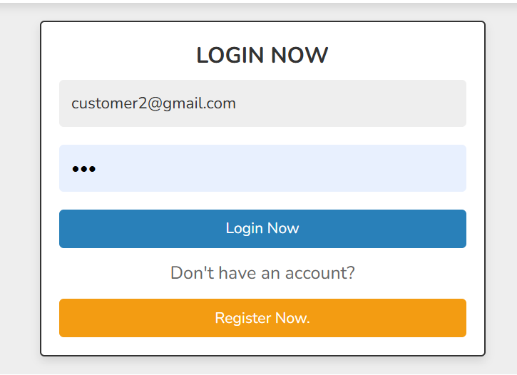

# 🛒 MOMAL.COM - E-Commerce Platform

<div align="center">


*A modern, full-featured e-commerce platform with AI-powered customer support*

[](https://php.net/)
[](https://mysql.com/)
[](https://javascript.info/)
[](https://developer.mozilla.org/en-US/docs/Web/HTML)
[](https://developer.mozilla.org/en-US/docs/Web/CSS)
[](https://ai.google.dev/)
[](https://opensource.org/licenses/MIT)

</div>

---

## 📌 Introduction

**MOMAL.COM** is a comprehensive e-commerce platform that combines traditional online shopping features with cutting-edge AI technology. Built with PHP and MySQL, it offers a complete shopping experience with user authentication, product management, shopping cart functionality, and an intelligent AI chatbot powered by Google Gemini API.

The platform serves as a one-stop destination for electronics and gadgets, featuring categories like smartphones, laptops, cameras, TVs, and more, with a modern, responsive design and robust admin panel for seamless management.

---

## 🚀 Features

### 🛍️ **Core E-Commerce Features**
- **User Authentication & Registration** - Secure login system with session management
- **Product Catalog** - Comprehensive product browsing with categories and search
- **Shopping Cart & Wishlist** - Add to cart, quantity management, and wishlist functionality
- **Order Management** - Complete order processing and tracking system
- **Admin Dashboard** - Full administrative control over products, users, and orders

### 🤖 **AI-Powered Features**
- **Intelligent Chatbot** - Google Gemini AI integration for customer support
- **Product Recommendations** - AI-driven product suggestions based on user queries
- **Smart Search** - Natural language product search capabilities

### 🎨 **User Experience**
- **Responsive Design** - Mobile-first approach with modern UI/UX
- **Interactive Sliders** - Swiper.js integration for smooth product browsing
- **Quick View** - Instant product preview without page reload
- **Category Filtering** - Easy navigation through product categories

### 🔧 **Technical Features**
- **Secure Database** - MySQL with prepared statements for SQL injection prevention
- **File Upload System** - Multiple image support for products
- **Session Management** - Secure user session handling
- **Input Validation** - Comprehensive data sanitization and validation

---

## 📸 Screenshots

<div align="center">

### 🏠 **Homepage & Navigation**

*Modern homepage with product sliders and category navigation*

### 🛒 **Shopping Experience**

*Product catalog with filtering and search capabilities*

### 👤 **User Interface**

*Clean and intuitive user authentication interface*

### 🤖 **AI Chatbot**

*AI-powered customer support chatbot*

### 📊 **Admin Panel**

*Comprehensive admin dashboard for store management*

### 📋 **Order Management**

*Detailed order tracking and management system*

### 💬 **Customer Feedback**

*User feedback and review system*

</div>

---

## 🖼️ Project Diagrams

<div align="center">

### 🏗️ **System Architecture**

*System class diagram showing component relationships*

### 🗄️ **Database Schema**

*Entity Relationship diagram of the database structure*

### 👥 **Use Case Diagram**

*Use case diagram showing user interactions and system functionality*

</div>

---

## 🛠️ Tech Stack

| **Category** | **Technology** | **Purpose** |
|--------------|----------------|-------------|
| **Backend** | PHP 8.1+ | Server-side logic and API development |
| **Database** | MySQL 10.4+ | Data storage and management |
| **Frontend** | HTML5, CSS3, JavaScript | User interface and interactions |
| **Libraries** | Swiper.js | Interactive sliders and carousels |
| **Icons** | Font Awesome 6.1.1 | UI icons and visual elements |
| **AI Integration** | Google Gemini API | Intelligent chatbot functionality |
| **Server** | XAMPP/Apache | Local development environment |

---

## ⚙️ Installation

### **Prerequisites**
- XAMPP (Apache + MySQL + PHP) or similar local server environment
- PHP 8.1 or higher
- MySQL 10.4 or higher
- Web browser (Chrome, Firefox, Safari, Edge)

### **Step-by-Step Setup**

1. **Clone the Repository**
   ```bash
   git clone https://github.com/yourusername/momal-ecommerce.git
   cd momal-ecommerce
   ```

2. **Setup XAMPP**
   - Download and install [XAMPP](https://www.apachefriends.org/)
   - Start Apache and MySQL services
   - Place project folder in `C:\xampp\htdocs\` (Windows) or `/Applications/XAMPP/htdocs/` (Mac)

3. **Database Setup**
   ```bash
   # Import the database
   # Open phpMyAdmin (http://localhost/phpmyadmin)
   # Create new database named 'shop_db'
   # Import the shop_db.sql file
   ```

4. **Configure Database Connection**
   ```php
   // Edit components/connect.php
   $db_name = 'mysql:host=localhost;dbname=shop_db';
   $user_name = 'root';
   $user_password = ''; // Your MySQL password
   ```

5. **Setup AI Chatbot (Optional)**
   ```php
   // Edit AI-Chatbot-with-PHP/chatbot.php
   $api_key = "your-gemini-api-key"; // Get from Google AI Studio
   ```

6. **Launch Application**
   ```bash
   # Open browser and navigate to:
   http://localhost/projectdone
   ```

---

## 📖 Usage

### **For Customers**
1. **Browse Products** - Navigate through categories or use search functionality
2. **Add to Cart** - Select products and quantities
3. **Checkout** - Complete purchase with order details
4. **Track Orders** - Monitor order status in your account
5. **Use AI Chatbot** - Get instant help with product queries

### **For Administrators**
1. **Login** - Access admin panel with admin credentials
2. **Manage Products** - Add, edit, or remove products
3. **Handle Orders** - Process and track customer orders
4. **User Management** - Monitor and manage user accounts
5. **Analytics** - View sales and performance metrics

### **Default Admin Credentials**
- **Username:** `admin`
- **Password:** `admin123` (change in production)

---

## 🤝 Contributing

We welcome contributions to improve MOMAL.COM! Here's how you can help:

### **How to Contribute**
1. **Fork the Repository** - Create your own fork of the project
2. **Create Feature Branch** - `git checkout -b feature/AmazingFeature`
3. **Commit Changes** - `git commit -m 'Add some AmazingFeature'`
4. **Push to Branch** - `git push origin feature/AmazingFeature`
5. **Open Pull Request** - Describe your changes and improvements

### **Contribution Guidelines**
- Follow PHP PSR-12 coding standards
- Add comments for complex functionality
- Test your changes thoroughly
- Update documentation as needed
- Ensure responsive design compatibility

---

## 📄 License

This project is licensed under the **MIT License** - see the [LICENSE](LICENSE) file for details.

```
MIT License

Copyright (c) 2024 MOMAL.COM

Permission is hereby granted, free of charge, to any person obtaining a copy
of this software and associated documentation files (the "Software"), to deal
in the Software without restriction, including without limitation the rights
to use, copy, modify, merge, publish, distribute, sublicense, and/or sell
copies of the Software, and to permit persons to whom the Software is
furnished to do so, subject to the following conditions:

The above copyright notice and this permission notice shall be included in all
copies or substantial portions of the Software.
```

---

## ⭐ Support

### **Getting Help**
- 📧 **Email Support** - Contact us at support@momal.com
- 💬 **Discord Community** - Join our developer community
- 📖 **Documentation** - Check our comprehensive docs
- 🐛 **Bug Reports** - Use GitHub Issues for bug reports

### **Show Your Support**
- ⭐ **Star this repository** if you found it helpful
- 🍴 **Fork the project** to contribute
- 📢 **Share with others** who might benefit
- 💡 **Suggest new features** via Issues

---

<div align="center">

**Built with ❤️ by the MOMAL.COM Team**

*Empowering e-commerce with AI-driven innovation*

[](https://github.com/yourusername/momal-ecommerce)
[](https://github.com/yourusername/momal-ecommerce)
[](https://github.com/yourusername/momal-ecommerce)

</div>
